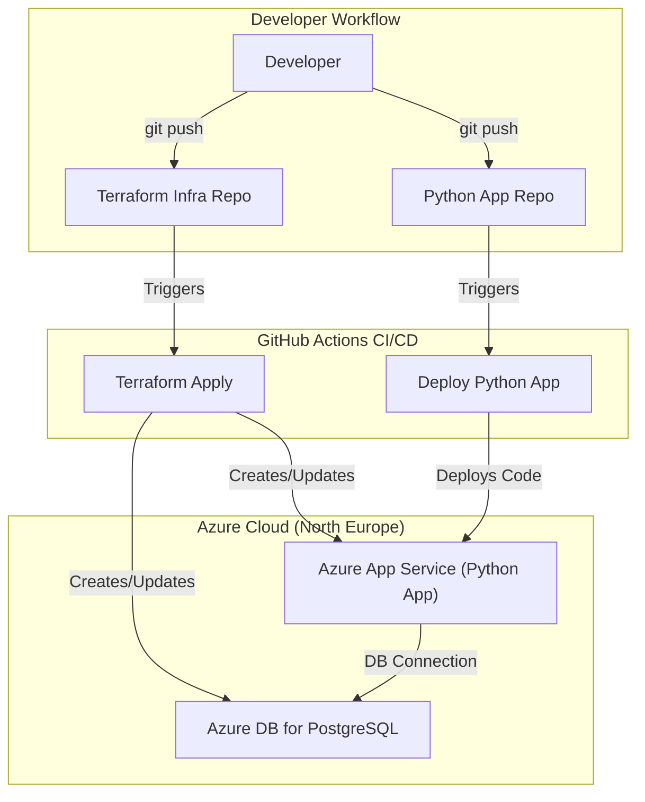

Azure Weather Forecast Application


It consists of a Python-based web application that fetches weather data, deployed on a scalable and secure **Azure** infrastructure, which is managed entirely through **Terraform** and automated with **GitHub Actions**.

## Table of Contents
- [Architecture Overview](#architecture-overview)
- [Architecture Diagram](#architecture-diagram)
- [Repository Structure](#repository-structure)
- [Prerequisites](#prerequisites)
- [Setup and Configuration](#setup-and-configuration)
- [Deployment Process](#deployment-process)
- [Usage](#usage)
- [Cleanup](#cleanup)

---

## Architecture Overview

The infrastructure is designed using a modern, PaaS-first approach to ensure scalability, security, and maintainability.

- **Application Hosting:** A Python Flask application runs on **Azure App Service for Linux**. The code is deployed directly from a GitHub repository.
- **Database:** **Azure Database for PostgreSQL (Flexible Server)** is used for persistent data storage.
- **Infrastructure as Code (IaC):** The entire Azure infrastructure is defined and managed using **Terraform** in a modular structure.
- **CI/CD Automation:** The project uses a dual-pipeline approach with **GitHub Actions**:
  - A workflow in the **Terraform** repository automates the deployment of the infrastructure.
  - A workflow in the **Python application** repository automates the deployment of the source code to the App Service.

---

## Architecture Diagram



---

## Repository Structure

This project is split into two separate GitHub repositories to follow best practices for separating application code from infrastructure code.

### Application Repository (`weather-forecast-app`)
- Contains the Python Flask application code (`app.py`, `templates/`, `requirements.txt`).
- Contains the GitHub Actions workflow (`.github/workflows/`) to deploy the application code to App Service.

### Infrastructure Repository (`weather-forecast-app-terraform`)
- Contains all the Terraform code (`main.tf`, `modules/`, etc.) to define the Azure resources.
- Contains the GitHub Actions workflows to apply and destroy the infrastructure.

---

## Prerequisites

Before you begin, ensure you have the following:

- An **Azure Subscription** with the necessary permissions.
- An **Azure Service Principal** with **Contributor** rights on the subscription.
- A free API key from **OpenWeatherMap**.
- The following tools installed locally (for initial setup):
  - Azure CLI
  - Terraform
  - Git

---

## Setup and Configuration

### 1) Clone Both Repositories
Clone both the application and infrastructure repositories to your local machine.

### 2) Create Azure Storage for Terraform State
Run the following commands:

```bash
# Log in to Azure
az login

# Create a resource group
az group create --name tfstate-rg --location "North Europe"

# Create a storage account (use a globally unique name)
az storage account create --name <your-unique-name> --resource-group tfstate-rg --sku Standard_LRS

# Create a container
az storage container create --name tfstate --account-name <your-unique-name>
```

### 3) Configure Terraform Backend
In your Terraform repository, create a file named `backend.tf` and add the following (replace the storage account name):

```hcl
terraform {
  backend "azurerm" {
    resource_group_name  = "tfstate-rg"
    storage_account_name = "<your-unique-name>"
    container_name       = "tfstate"
    key                  = "prod.terraform.tfstate"
  }
}
```

### 4) Set Up GitHub Secrets

In **both** the Terraform and Python Application repositories, go to  
**Settings → Secrets and variables → Actions** and add:

- `AZURE_CLIENT_ID`
- `AZURE_CLIENT_SECRET`
- `AZURE_TENANT_ID`
- `AZURE_SUBSCRIPTION_ID`

In the **Terraform** repository only, also add:

- `POSTGRES_ADMIN_PASSWORD` (a complex password of your choice)

---

## Deployment Process

Deployment is fully automated via **GitHub Actions**.

### Deploy Infrastructure
- Commit and push any changes to the **main** branch of your **Terraform** repository.  
- This triggers the **“Deploy Terraform Infrastructure”** workflow, which creates/updates Azure resources.

### Deploy Application
- Commit and push any changes to the **main** branch of your **Python application** repository.  
- This triggers the **“Deploy Python App”** workflow, which deploys the source code directly to App Service.

---

## Usage

- After a successful infrastructure deployment, the `app_service_url` will be displayed in the outputs of the GitHub Actions workflow run.
- You can also find the URL in the **Azure Portal** on the **Overview** page of the **App Service**.
- Browse to this URL to use the application.

---

## Cleanup

To avoid ongoing costs, you can destroy all created infrastructure:

1. Go to your **Terraform** GitHub repository.
2. Navigate to the **Actions** tab.
3. Select the **“Destroy Terraform Infrastructure”** workflow on the left.
4. Click **“Run workflow”** to delete all resources from your resource group.
